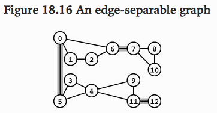
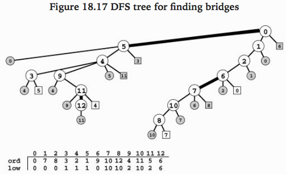

= Tarjan
////
Big ol' comment

sittin' right 'tween this here title 'n header metadata
////
Dan Allen <thedoc@asciidoctor.org>
:description: A demo of Asciidoctor. This document +
              exercises numerous features of AsciiDoc +
              to test Asciidoctor compliance.
:source-highlighter: pygments
:stylesheet: maker.css
//:imagesdir: images
//:backend: docbook45
//:backend: html5
//:doctype: book
//:sectids!:
//:plus: &#43;

https://www.ime.usp.br/~pf/algoritmos_para_grafos-2017-04-06/aulas/tarjan.html

## Floresta radicada

*Def:* é um digrafo `topologicamente numerado` sem vértices com grau de entrada maior que 1 (ex: floresta DFS).

Terminologia para falar sobre florestas radicadas:

- Um vértice `u` é ancestral de um vértice `z` se o único caminho que vai de uma raiz até `z` passa por `u`. (um ancestral de `z` é próprio se for diferente de `z`)
- Um vértice `z` é descendente de um vértice `u` se `u` for ancestral de `z`. (um descendente próprio de `u` é próprio se for diferente de `u`)

### Posição relativa dos vértices na floresta DFS

Suponha que pre[] e post[] são as numerações em pré- e pós-ordem de um digrafo G.  Seja F a correspondente floresta DFS de G.  Como já observamos em outra ocasião, se um vértice x é ancestral de um vértice y em F então pre[x] ≤ pre[y].  É claro que se x é ancestral próprio de y então pre[x] < pre[y].  Mas a recíproca dessa afirmação não é verdadeira.  Para completar a caracterização é preciso recorrer à numeração em pós-ordem:

- x é ancestral próprio de y se e somente se pre[x] < pre[y] e post[x] > post[y];
- y é descendente próprio de x se e somente se pre[y] > pre[x] e post[y] < post[x].

Em termos mais informais, x é ancestral próprio de y se e somente se x foi descoberto antes de y durante a busca DFS e morreu depois de x.  Analogamente, y é descendente próprio de x se e somente se y ≡ x ou y foi descoberto depois de x e morreu antes de x.

Dito de outra maneira, x é ancestral próprio de y se o intervalo de tempo durante o qual dfsR(G,x) estava em execução contém propriamente o intervalo durante o qual dfsR(G,y) estava em execução.  Analogamente, y é descendente próprio de x se o intervalo de dfsR(G,y) está propriamente contido no intervalo de dfsR(G,x).

**Primos.**  Uma floresta DFS é mais que uma simples floresta radicada pois além das noções de acima (ancestral) e abaixo (descendente) ela tem as noções de esquerda e direita.  Dados vértices x e y, dizemos que

- x é primo esquerdo de y se pre[x] < pre[y] e post[x] < post[y] e
- y é primo direito de x se pre[y] > pre[x] e post[y] > post[x].

Portanto, x é primo esquerdo de y se x morreu antes de y (e portanto foi descoberto antes de y) durante a busca DFS.  Analogamente, y é primo direito de x se y foi descoberto depois de x (e portanto morreu depois de x).  Dito de outra maneira, x e y são primos se os intervalos de tempo durante os quais dfsR(G,x) e dfsR(G,y) estavam em execução são disjuntos.

## Algoritmo de Tarjan

Similar ao algoritmo usado para achar pontes (`bridges`) em grafos indiretos com algumas modificações. Primeiro, consideramos os vértices na ordem topologica reversa na qual é possível saber que todos os descendentes de um vértice já foi visitado anteriormente. Segundo, um `back link` na árvore DFS indica um segundo caminho, unindo os vértices do mesmo componente forte.

Como o algoritmo é baseado na busca das pontes, vamos começar descrevendo este algoritmo e como implementa-lo. As pontes em um grafo indireto são arestas que ao serem removidas aumentam o número de componentes conectados do grafo.

Para determinar quais arestas são pontes, vamos usar a caracterização dos links da árvore DFS gerada. Com isso, independente do nó escolhido como raíz da árvore, teremos o mesmo resultado final. Mantendo um vetor `pre` indexado pelos vértices `v`, podemos rastrear a ordem `pre[v]` na qual o vértice `v` chamado em cada recursão é visitado. Com a ajuda deste vetor podemos classificar os links entre os vértices `v-w` de uma árvore DFS de um grafo indireto em 4 tipos:

- `Tree link` se `w` não foi visitado (não marcado);
- `Parent link` se `Pais[w] = v`;

- `Back link` se `ord[w] < ord[v]`;
- `Down link` se `ord[w] > ord[v]`;

Apesar dos links parent e back representarem retorno a um ancestral de `v`, o link parent não já foi visitado e não traz mais informações ao grafo. Por outro lado, o link back aumenta a informação sobre a estrutura do grafo. O link parent é obtido quando estamos retornando de um caminho determinado pela chamada da recursão do DFS.

A árvore DFS abaixo do grafo anterior representa as arestas identificadas como `bridges` marcadas e os 4 tipos de links. Os links `tree` são vértices redondos, `parent` redondo hachurado, `back` são representados em quadrado e `down` são os quadrados hachurados.

Como uma ponte `v-w` separa os componentes de um grafo, os descendentes do nó `w` não devem apontar para nenhum ancestral de `w`. Pois, caso isso ocorra, estariamos voltando para outra posição do grafo que estamos desconectando. Levando a uma contradição. Repare na figura que nenhum descendente dos nós 5, 7 e 12 retornam a um ancestral deles. Por outro lado, repare que ao existir um `back link` levando a um acentral após qualquer `tree link` podemos estar diante de uma `bridge`.

“For every vertex v, we use the recursive function to compute the lowest preorder number that can be reached by a sequence of zero or more tree edges followed by a single back edge from any node in the subtree rooted at v. If the computed number is equal to v’s preorder number, then there is no edge connecting a descendant with an ancestor, and we have identified a bridge. The computation for each vertex is straightforward: We proceed through the adjacency list, keeping track of the minimum of the numbers that we can reach by following each edge. For tree edges, we do the computation recursively; for back edges, we use the preorder number of the adjacent vertex. If the call to the recursive function for an edge w-t does not uncover a path to a node with a preorder number less than t’s preorder number, then w-t is a bridge.”

Excerpt From: Robert Sedgewick. “Algorithms in C++ Part 5: Graph Algorithms, Third Edition.”

Segue o código extraído do Sedgewick:

[source,c++,linenum]
----
template <class Graph> class EC
{
  int bcnt;
  vector<int> low;
  void searchC(edge e)
  {
    int w = e.w;
    ord[w] = cnt++; low[w] = ord[w];
    typename Graph::adjIterator A(G, w);
    for (int t = A.beg(); !A.end(); t = A.nxt())
    {
      if (ord[t] == -1){
        searchC(Edge(w, t));
        if (low[w] > low[t]) low[w] = low[t];
        if (low[t] == ord[t])
          bcnt++; // w-t is a bridge
      } // end if
      else if (t != e.v)
        if (low[w] > ord[t]) low[w] = ord[t];
    } // end for
  } // end searchC()

public:
  EC (const Graph &G) : SEARCH<Graph>(G), bcnt(0), low(G.V(), -1)
    {  search(); }
  int count() const { return bcnt+1; }
};
----

A linha 8 define o valor de pré-ordem e inicializa o valor de low igual ao de pré-ordem do vértice `w`. Para cada vértice não marcado que a recursão se aprofunda, isto é, seguindo os links da tree vamos marcando-os e definindo os valores de pré e low para este vértice. Quando chegamos num `back link`, isto é, quando ao fazer o loop na lista de adjacência do vértice `w` e encontrarmos um vértice `t` já marcado na lista (não satisfaz condição linha 12), isto é, um possível ancestral checamos se ele não é a volta do caminho do DFS ( condição na linha 18 ), se não for e tiver valor de pré-ordem menor que low[`w`] ele é um back links que retorna a `w`. Com isso, toda a subárvore seguindo para cima de `t` até `w` terá o valor de low alterado para o valor de low[`w`] (linha 14). Uma aresta w-t é bridge se low[t] == ord[t] (linha 15).

O algoritmo de conectividade acima para detectar pontes em grafos indiretos é a base para a solução de Tarjan ótima para descobrir componentes fortemente conectados em digrafos.

[source,c++,linenum]
.Tarjan.cc
----
include::Tarjan.cc[]
----

O algoritmo de Tarjan é baseado no DFS recursivo modificado para empurrar os vértices na pilha. Usando um DFS para considerar os vértices em ordem topológica reverse, computamos, para cada v, o ponto mais alto alcançável por um back link entre os descendentes de v. Quando um vértice v tem pre[v] = low[v] 
